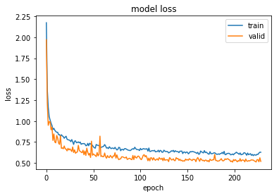
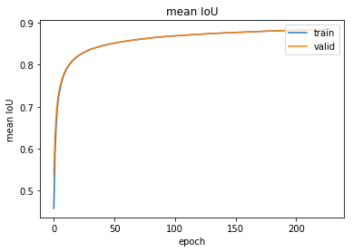
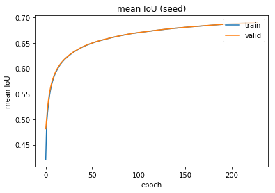

# nuclei_instance_segmentation

### NOTE: PLEASE USE KERAS==2.1.4
### WE EXPERIENCED STRANGE ISSUE WITH KERAS==2.2.0

### Model


### Results







### Evaluaiton

```
validation loss: 0.5188
validation mean IoU: 0.8843
validation mean IoU (seed): 0.6904

AP@0.50 = 0.9176
AR@0.50 = 0.7556
-----
AP@0.55 = 0.9003
AR@0.55 = 0.7414
-----
AP@0.60 = 0.8827
AR@0.60 = 0.7268
-----
AP@0.65 = 0.8591
AR@0.65 = 0.7075
-----
AP@0.70 = 0.8275
AR@0.70 = 0.6814
-----
AP@0.75 = 0.7830
AR@0.75 = 0.6448
-----
AP@0.80 = 0.6958
AR@0.80 = 0.5730
-----
AP@0.85 = 0.5535
AR@0.85 = 0.4558
-----
AP@0.90 = 0.3442
AR@0.90 = 0.2835
-----
AP@0.95 = 0.0828
AR@0.95 = 0.0681
-----
mAP@[.5:.95] = 0.6847
mAR@[.5:.95] = 0.5638
```
