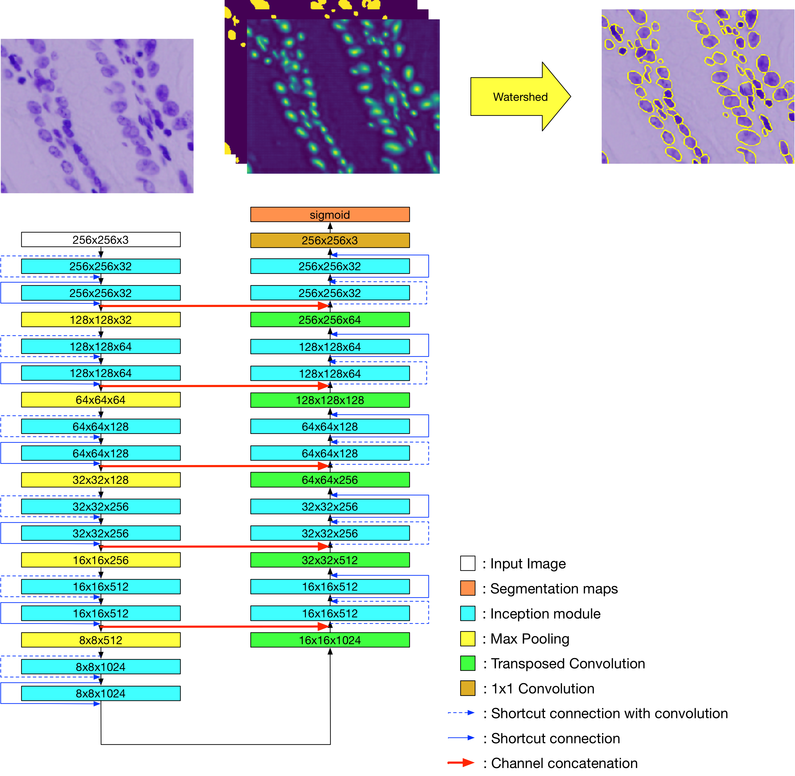

# nuclei_instance_segmentation

### Model



### Evaluaiton

```
AP@0.50 = 0.8890
AR@0.50 = 0.7620
-----
AP@0.55 = 0.8686
AR@0.55 = 0.7444
-----
AP@0.60 = 0.8459
AR@0.60 = 0.7250
-----
AP@0.65 = 0.8269
AR@0.65 = 0.7087
-----
AP@0.70 = 0.7873
AR@0.70 = 0.6747
-----
AP@0.75 = 0.7353
AR@0.75 = 0.6302
-----
AP@0.80 = 0.6385
AR@0.80 = 0.5472
-----
AP@0.85 = 0.5014
AR@0.85 = 0.4297
-----
AP@0.90 = 0.3004
AR@0.90 = 0.2574
-----
AP@0.95 = 0.0618
AR@0.95 = 0.0530
-----
mAP@[.5:.95] = 0.6455
mAR@[.5:.95] = 0.5532

```
